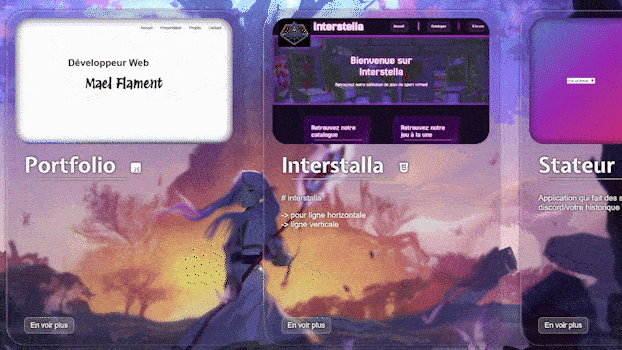

# Liquid Glass CSS / React

Liquid Glass is a lightweight CSS/JavaScript library inspired by Apple’s Liquid Glass aesthetic.
It provides a frosted glass effect with subtle refraction, blur and dynamic color tinting based on the surrounding environment.

The library is available in two variants:

🧱 Vanilla CSS / JS

⚛️ React Components

---

## 📸 Preview

👉 View live demo on my **[portfolio](https://mael-667.github.io/portfolio/)**



---

## ✨ Features

- 🪟 Glass effect with SVG displacement
- 🎨 Dynamic color tinting based on surrounding backgrounds
- 🔧 Adjustable blur intensity (0-10 levels)
- 💡 Light & large variants
- ⚛️ React-first API with automatic style injection
- 🧱 Vanilla CSS/JS version available
- 📦 Zero external dependencies
- 🚀 Lightweight and performant
- No build tools required for vanilla version

---

## 🚀 Quick Start

### React (Recommended)

Install via **npm:**
```bash
npm install @mael667/liquid-glass-react
```


Wrap your application with `<LiquidGlassProvider>` to inject styles and activate dynamic color features:

```jsx
import { LiquidGlassProvider, LiquidGlass } from "@mael667/liquid-glass-react";

function App() {
  return (
    <LiquidGlassProvider>
      <LiquidGlass>
        Hello Liquid Glass
      </LiquidGlass>
    </LiquidGlassProvider>
  );
}
```

### Vanilla CSS/JS

```html
<head>
  <script src="/path/to/liquidGlass.js"></script>
</head>
<body>
  <div class="liquidGlass">
    Hello Liquid Glass
  </div>
</body>
```

---

## 📦 Installation

### React Version

**Install the component:**

Via npm:
```bash
npm install @mael-667/liquid-glass-react
```

**Or download the component:**

1. Download [LiquidGlassProvider.jsx](https://github.com/Mael-667/Liquid-Glass-CSS/releases) from the releases page
2. Copy the file into your project (e.g., `src/components/`)
3. Import and use in your app

```jsx
import { LiquidGlassProvider, LiquidGlass, Tint } from "./components/LiquidGlassProvider";
```

### Vanilla Version

**Download the script:**

1. Download [liquidGlass.js](https://github.com/Mael-667/Liquid-Glass-CSS/releases) from the releases page
2. Include it in your HTML `<head>`:

```html
<script src="/path/to/liquidGlass.js"></script>
```

The script automatically injects the required CSS and SVG filters.

---

## 📖 Documentation

## ⚛️ React API

### Setup

The `<LiquidGlassProvider>` component must wrap your application. It automatically:
- Injects required CSS styles
- Enables SVG filters
- Activates the dynamic color system

```jsx
import { LiquidGlassProvider } from "@mael667/liquid-glass-react";

function App() {
  return (
    <LiquidGlassProvider>
      {/* Your app components */}
    </LiquidGlassProvider>
  );
}
```

### `<LiquidGlass />` Component

The main component for creating glass effect elements.

```jsx
<LiquidGlass large dynamic hoverable>
  Content here
</LiquidGlass>
```

#### Props

| Prop        | Type      | Default | Description                                    |
|-------------|-----------|---------|------------------------------------------------|
| `as`        | `string`  | `div`   | HTML tag to render (e.g., `nav`, `button`)     |
| `large`     | `boolean` | `false` | Use large glass variant                        |
| `className` | `string`  | `""`    | Additional CSS classes                         |
| `dynamic`   | `boolean` | `false` | Enable dynamic color tinting                   |
| `hoverable` | `boolean` | `false` | Enable hover tint effect (requires `dynamic`)  |

**Examples:**

```jsx
// Basic usage
<LiquidGlass>
  Basic glass effect
</LiquidGlass>

// Navigation with large variant
<LiquidGlass as="article" large>
  Navigation
</LiquidGlass>

// Button with dynamic tint
<LiquidGlass as="button" dynamic hoverable>
  Click me
</LiquidGlass>
```

---

### `<Tint />` Component

Defines colored areas that affect overlapping `LiquidGlass` components with `dynamic` enabled.

```jsx
<Tint as="section" hue="#4169e1">
  Content with blue tint
</Tint>
```

#### Props

| Prop  | Type     | Default | Description                        |
|-------|----------|---------|------------------------------------|
| `as`  | `string` | `"div"` | HTML tag to render                 |
| `hue` | `string` | -       | Hex color for tinting (required)   |

**Example with dynamic tinting:**

```jsx
<header>
  <LiquidGlass as="nav" dynamic hoverable>
    Home
  </LiquidGlass>
</header>

<Tint as="section" hue="#4169e1">
  <h2>Blue Tinted Section</h2>
  <p>Glass elements above will adapt to this color</p>
</Tint>

<Tint as="section" hue="#ff6b6b">
  <h2>Red Tinted Section</h2>
  <p>Different tint for this area</p>
</Tint>
```

---

## 🧱 Vanilla CSS/JS API

### Available Classes

| Class               | Description                                |
|---------------------|--------------------------------------------|
| `.liquidGlass`      | Basic frosted glass effect                 |
| `.liquidGlassLarge` | Larger glass variant                       |
| `.glassLightMode`   | Light mode variant                         |
| `.liquidBtn`        | Pre-styled glass button                    |
| `.blur-[0-10]`      | Blur intensity (e.g., `.blur-5`)           |
| `.dynamicHue`       | Enable dynamic color tinting               |
| `.dynamicHueHvr`    | Dynamic tint with hover effect             |

### Basic Usage

```html
<!-- Basic glass -->
<div class="liquidGlass">
  Content
</div>

<!-- Large variant with high blur -->
<div class="liquidGlassLarge blur-8">
  Large glass
</div>

<!-- Glass button -->
<button class="liquidBtn">
  Click me
</button>
```

### Dynamic Color System

Define tinted areas using the `data-hue` attribute:

```html
<nav class="dynamicHueHvr">
  <div class="liquidGlass">
    Navigation
  </div>
</nav>

<section data-hue="#4169e1">
  <!-- Blue tinted area -->
  <h2>Section Title</h2>
</section>

<section data-hue="#ff6b6b">
  <!-- Red tinted area -->
  <h2>Another Section</h2>
</section>
```

**How it works:**

1. Add `data-hue="#hexcolor"` to any element to define a tinted area
2. Add `.dynamicHue` or `.dynamicHueHvr` to a parent of your glass elements
3. Glass elements automatically adjust their colors when overlapping tinted areas

---

## 🎨 Customization

You can override default styles with custom CSS:

### Border Radius

```css
.liquidGlass,
.liquidGlass::before,
.liquidGlass::after {
  border-radius: 2rem;
}
```

### Background & Shadows

```css
.liquidGlass::after {
  background: rgba(230, 18, 18, 0.1);
  box-shadow:
    inset 1px 1px 3px rgba(238, 0, 0, 0.39),
    inset -1px -2px 3px rgba(0, 0, 0, 0.3),
    0 0 20px rgba(0, 0, 0, 0.5);
}
```

### Blur Intensity Scale

Blur levels range from 0 (no blur) to 10 (maximum blur):

---

## ⚡ Performance & Bundle Size

- **React version**: ~15KB minified
- **Vanilla version**: ~8KB minified
- **Zero dependencies**
- **CSS-in-JS with automatic injection**
- **Minimal runtime overhead**

---

## ♿ Accessibility

The library maintains semantic HTML and doesn't interfere with:
- Screen readers
- Keyboard navigation
- Focus indicators

Ensure you provide appropriate ARIA labels and semantic elements when using `as` prop.

---

## 🌐 Browser Compatibility

| Browser | Version |
|---------|---------|
| Chrome  | 90+     |
| Firefox | 88+     |
| Safari  | 14+     |
| Edge    | 90+     |

*Requires support for CSS backdrop-filter and SVG filters.*

---

## 🤝 Contributing

Contributions are welcome! Here's how you can help:

1. **Report bugs** - Open an issue with reproduction steps
2. **Suggest features** - Share your ideas in discussions
3. **Submit PRs** - Fork, create a branch, and submit a pull request
4. **Improve docs** - Help make the documentation clearer

---

## 📬 Feedback

Found a bug or have suggestions? 

- Open an issue on [GitHub](https://github.com/Mael-667/Liquid-Glass-CSS/issues)
- Check out the [live demo](https://mael-667.github.io/portfolio/)

**Made with ❤️ by me 🐐**